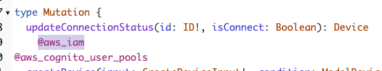
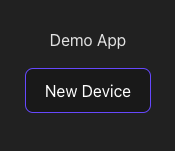

# Demo of mutating from Lambda to AppSync and subscribing from React App

[日本語の情報(for Japanese)](https://blog.msysh.me/posts/2024/06/mutate-to-appsync-from-lambda-and-deliver-realtime-events.html)

This project is an Amplify Gen2 demo app that Lambda mutates to AppSync and delivers events to subscribed React App in near real time.
Lambda is triggered to update items in DynamoDB via DynamoDB Streams.

## Architecture



## Getting Started

### 1. Clone this project

```shell
git clone https://
```

### 2. Install packages

```shell
pnpm install   # or npm install
```

### 3. Launch sandbox

```shell
pnpm exec ampx sandbox   # or npx ampx sandbox
```

### 4. Update AppSync schema via AWS Management Console

At the moment, it is not possible to use IAM authentication with custom mutations, so we will change the schema from the AWS Management Console.

1. After logging in to the AWS Management Console, select the API from AppSync, and then select the "Schema" from the left menu.
2. In the "Mutation" section, find `updateConnectionStatus` and insert `@aws_iam`, and then "Save Schema"


This issue is also being discussed on GitHub.
* [Unable to use “iam” authorization for custom mutations in v6.2 #13339](https://github.com/aws-amplify/amplify-js/issues/13339)

### 5. Launch React app

```shell
pnpm run dev
```

Let's access `http://localhost:5173` and create a your account.

That account will be created in the Cognito UserPool you just deployed in your AWS account.

### 6. Create a new item in DynamoDB

Pressing the “New Device” button will create a new item in DynamoDB.



### 7. Update DynamoDB items directly

When you explore for the DynamoDB table in the AWS Management Console, the device is created.
Edit directly the `isConnect` attribute of the item from `false` to `true`.

### 8. Check the display with a React App

Please check that the `isConnect` column for the item displayed in the React app is updated in near real time.

## Cleanup

Simply stopping the sandbox will not delete the AWS resources. Use the following command to delete the sandbox.

```shell
pnpm exec ampx sandbox delete   # or npx ampx sandbox delete
```

## License

MIT